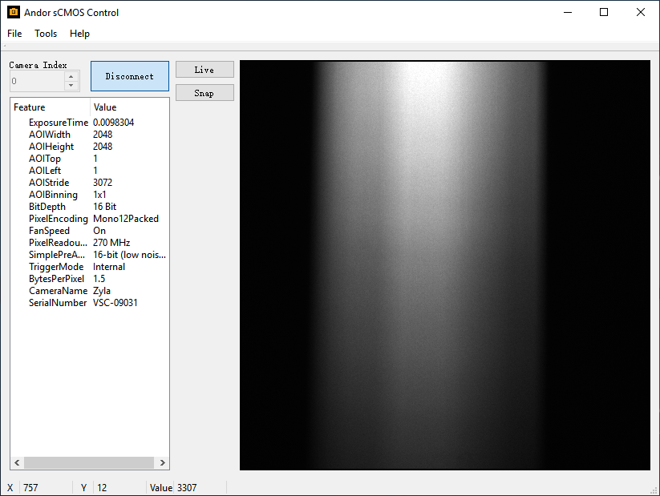

# Andor sCMOS Control

A GUI application for Andor sCMOS, based on Qt framework.



## Overview

This application is built for Andor Zyla 4.2 sCMOS (USB 3.0 version). I think it will also works for other Andor cameras, if they are supported by Andor SDK3. 

The original purpose of writing this is making sCMOS cooperate with Horiba's monochromator. It's a normal camera controlling application, integrated with a simple remote call server, which can be use to communicate with other instruments' controlling application.

It can

- modify camera properties
- snap images
- live preview
- open a server, wait for remote calls

## Install

### Windows

First, make sure the camera can be found by you computer. Open the `Device Manager` of Windows, check if the camera is properly recognized. If not, install camera's driver which is included in Andor SDK (c++, LabVIEW, MATLAB).

Download the latest pre-build package for windows, then install it.

## Usage

Power up the camera, connect to computer. (NOTE: If your camera is USB 3.0 version, make sure the cable and the USB port is capable with USB 3.0. Or, you may suffer a lot of trouble.)

Open the application, connect the camera.

### Modify camera properties

You can modify the properties by click on the property browser. Press <kbd>Enter</kbd> to commit changes.

### Acquisition

Click `Snap` to capture an image. Click `Live` to open a live preview. You can save current image.

### Remote call server

If some instruments want the camera to capture a series of images at the right moment, you can use the remote call server. 

It works like a software external trigger. Sends a request to the server, then the server will control the camera to do the things.

For example, The monochromator expects the camera to capture a image after each movement of the center wavelength. Integrate monochromator's controlling program with a TCP socket client. Every time monochromator has adjusted the center wavelength, send a request to the remote call server through socket. The server will reply when it has done the jobs which the monochromator requested. Then the monochromator can move to next center wavelength and send next request.

More details about remote call can be found in the following section.

## Build

### Requirments

- Qt
- Andor SDK3
- openCV

Follow the Qt wiki [How to setup Qt and openCV on Windows](https://wiki.qt.io/How_to_setup_Qt_and_openCV_on_Windows) to setup Qt and openCV. Install Andor SDK3.

Open `.pro` file with Qt Creator, you may need to configure the project. check if the include/lib paths in `.pro` file are correct.

Run `qmake` (`Build > Run qmake`) every time you modify the `.pro` file.

Build the project (`Build > Build Project`).

## Remote Call

The idea is from RPC server, but is much simpler. It's based on TCP socket. When the server receives a request, it will keep the socket connection, until the job is done and send an 'ack' message. Currently, 'ack' message is always "0", maybe later it will be implemented to carry more information.

### Format

Request format:
```
i:<id>;m:<method>;p:[param1,param2,...]
```

- `id`: a unique string for identification. (currently has no effect)
- `method`: method/function name provided by remote call server
- `paramN`: parameters of method/function

Ack format:
```
0
```

### API references

```
Method: snap
Parameters:
    filename: File basename for image saving.
    metadata: Extra information.
```

